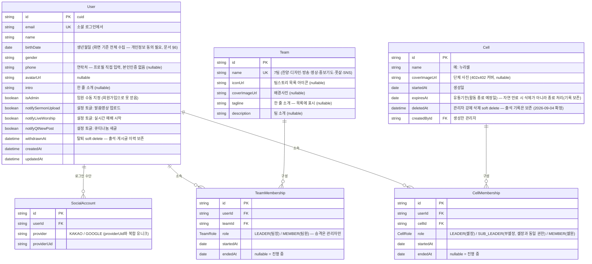
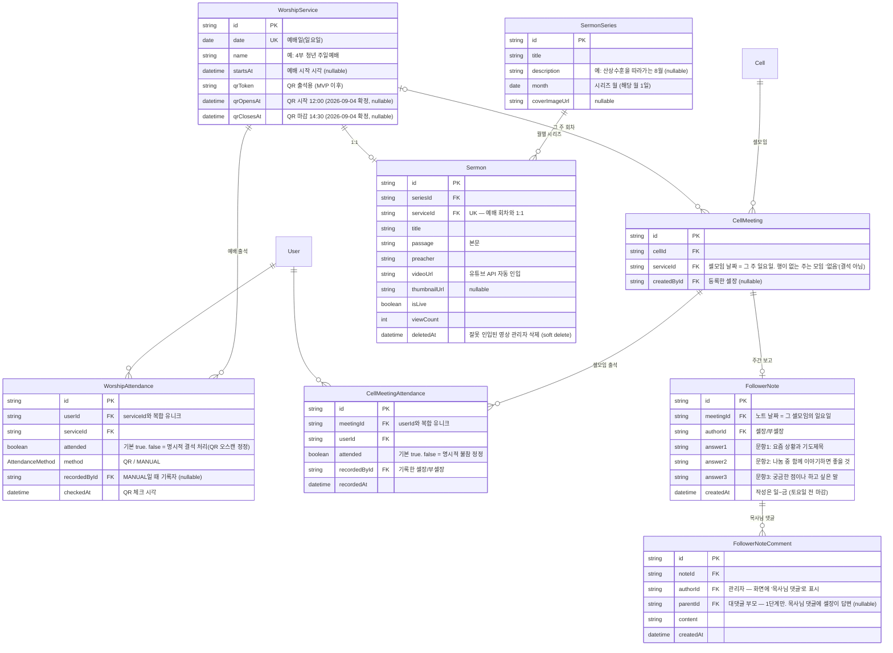
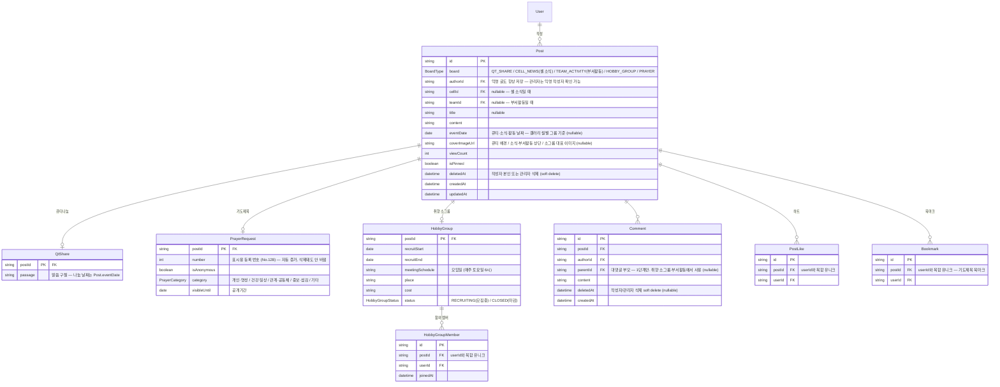
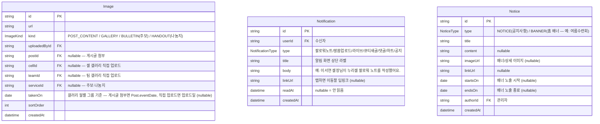

# ERD (목표 설계)

> **상태: 확정 (2026-09-02)** — [attendance-data-model.md](attendance-data-model.md)의 미결 중 팀장 표현·소속 팀 이력·셀모임 주기는 아래 구조로 확정했고, 출석 기록 방식도 attended+기록자 저장으로 확정했다. 남은 미결(문서 §6)이 확정되면 함께 갱신한다.

이 문서는 [schema.prisma](../apps/api/prisma/schema.prisma)로 **구현되어 있다** — 스키마를 바꾸면 이 문서도 같은 턴에 갱신한다.
기존 이메일/비밀번호 인증이 참조하는 레거시 필드(`User.password`·`cellName`·`teamId`·`role`)는 소셜 로그인 전환 시 제거 예정이라 스키마에만 있고 이 문서에는 표기하지 않는다. 생성·수정 시각(`createdAt`/`updatedAt`)도 다이어그램에서는 대부분 생략한다 — 스키마에는 전 테이블에 있다. QR 출석·엑셀 추출은 MVP 이후 기능이다.

## 1. 회원·조직

- 게스트(비로그인)는 DB에 행을 만들지 않는다.
- 셀장+부셀장 합쳐 최대 2명, 동시 활성 셀/팀 멤버십은 1개 — 구조가 아니라 앱 로직으로 보장한다.
- 셀·팀 생성/삭제는 관리자 전용. 승격된 셀장/팀장은 자기 페이지 수정만 가능하다.

## 2. 예배·출석·셀 관리

- **출석은 행 존재 = 참석(O), 없음 = 결석(X)** 으로 계산한다. 정정을 위해 `attended`(false = 명시적 결석 처리)와 기록자(`recordedById`)를 저장하고, 예배 출석은 기록 방식(`method`: QR/수동)도 남긴다 — QR 오스캔을 행 삭제 없이 정정할 수 있고 누가 기록했는지 이력이 남는다. 셀모임 출석은 항상 셀장이 기록하므로 method 없이 기록자만 저장한다. O/X 표기와 통계는 조회 시 계산 — [attendance-data-model.md §5](attendance-data-model.md).
- 팔로워 노트 열람은 본인 셀 셀장·부셀장 + 관리자만 (게시판이 아니라 셀 관리 기록이라 Post에 넣지 않는다).

## 3. 게시판 (공용 Post + 게시판별 확장)

- 공용 Post로 묶는 이유: 댓글·하트·북마크·이미지·조회수가 Post 하나만 참조하면 되고, **관리자의 "모든 게시물 삭제"·"받은 하트 수" 같은 횡단 기능**이 한 곳에서 구현된다. (Prisma는 다형 관계 미지원 → 게시판별 고유 필드는 1:1 확장 테이블로.)

## 4. 공용·기타

- 갤러리는 "그 셀/팀 게시글 사진 + 직접 올린 사진"을 합쳐 월별로 보여준다. **게시글 사진 자동 포함 확정 (2026-09-04)** — 반드시 소속에 맞게 매칭한다: A셀 소식(`Post.cellId=A`)의 첨부는 A셀 갤러리에만, B팀 부서활동(`Post.teamId=B`)의 첨부는 B팀 갤러리에만 노출된다.

## 설계 메모 (결정 근거)

- **팀 소속도 셀과 같은 멤버십 구조** — 팀원 관리 화면(추가/삭제)과 맞고, "소속 팀 이력" 미결이 같이 해결된다. 팀장 = `TeamMembership.role = LEADER`, 셀장 = `CellMembership.role = LEADER`. 별도 등급 enum이 없어졌고, 승격/강등 = 관리자가 멤버십 역할을 바꾸는 것.
- **예배 회차(`WorshipService`)를 엔티티로 분리** — 설교·영상·주보·QR·실시간 예배가 전부 매주 예배일에 붙으므로 자연스럽게 연결되고, `CellMeeting` 분리로 "셀모임 없는 주"가 결석이 아니라 자동으로 '없음'이 된다.
- **문서 vs 화면이 다른 곳은 화면 기준** — 생년월일 전체(DATE), 부셀장 역할, 배경사진·소개 컬럼. 화면이 더 최신·구체적이다.
- **저장하지 않고 계산하는 것**: 나이, 출석 횟수·주수, 큐티나눔 수, 받은 하트 수 (근거: [attendance-data-model.md §5](attendance-data-model.md)).
- 회원탈퇴·게시글 삭제·셀 삭제는 soft delete — 출석·이력이 끊기지 않게. **보관 기간 (2026-09-03 확정)**: 회원 탈퇴는 30일 후 개인정보 파기하되 출석 기록은 익명화해 보존(통계용), 게시글·댓글은 당분간 무기한 보관(정리 배치는 필요해질 때 추가). 출시 전 개인정보처리방침에 명시할 것.

## 미결 (구조에 영향 없어 진행 가능, 확정 시 갱신)

- ~~QR 자동 체크 상충~~ → **확정 (2026-09-03): QR은 예배 출석만 기록한다.** 셀모임은 기본 결석이고, 셀장이 출석 관리 화면에서 온 사람을 직접 체크한다 — 그 주 예배 QR 명단을 참고로 표시해주면 확인이 빠르다. 화면 안내문("QR 찍으면 셀모임까지 자동 체크")은 화면 쪽을 이 흐름에 맞게 고친다.
- ~~QR 마감 시각~~ → **확정 (2026-09-04): QR 유효 시간 12:00~14:30** (`WorshipService.qrOpensAt`/`qrClosesAt`).
- ~~갤러리 게시글 사진 자동 포함~~ → **확정 (2026-09-04): 자동 포함** — 위 §4 매칭 규칙 참고. 디자이너에게 공유할 것.
- ~~부서활동 게시판 업로드 권한~~ → **확정 (2026-09-03): 해당 팀 소속 팀원 모두 작성 가능.**
- ~~셀 강제 삭제 시 출석 기록 처리~~ → **확정 (2026-09-04): 기록 보존** — 셀은 soft delete로 숨기고 출석·팔로워 노트 기록은 남긴다(통계·엑셀 유지, 표시는 "(삭제된 셀)").
