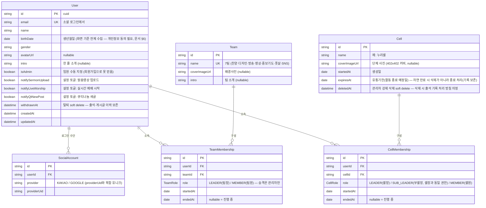
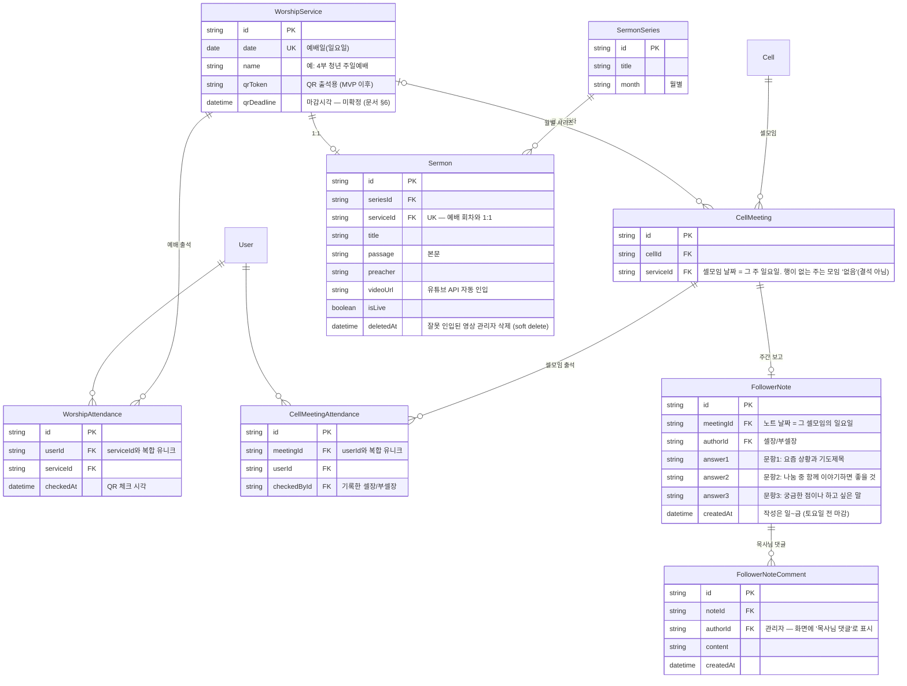
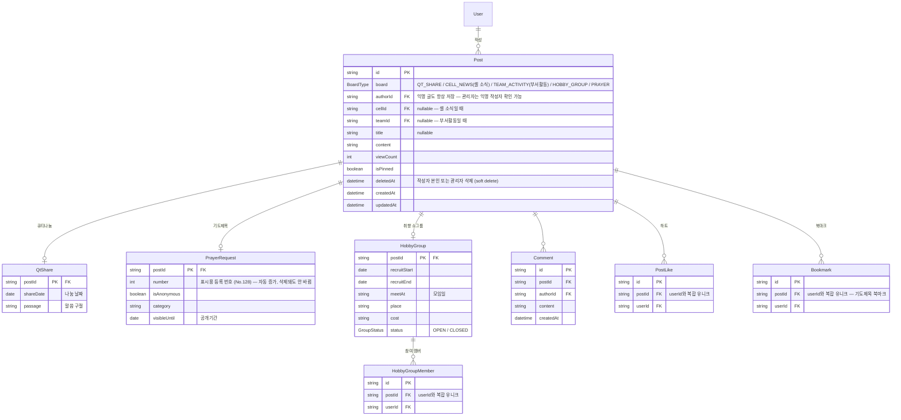
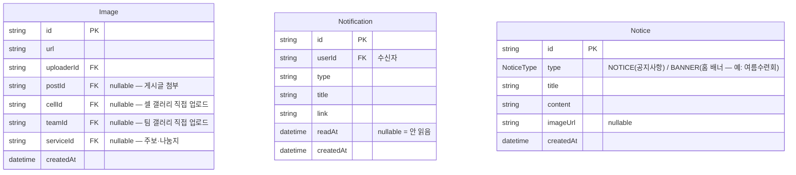

# ERD (목표 설계)

> **상태: 결정 반영 (2026-09-01)** — [attendance-data-model.md](attendance-data-model.md)의 미결 중 팀장 표현·소속 팀 이력·셀모임 주기는 아래 구조로 확정했다. 남은 미결(문서 §6)이 확정되면 함께 갱신한다.

현재 [schema.prisma](../apps/api/prisma/schema.prisma)의 모델(User/Team/Post)을 대체할 전체 데이터 모델이다.
셀·출석 관련 모델은 **아직 구현 전**이며, QR 출석·엑셀 추출은 MVP 이후 기능이다.

## 1. 회원·조직

- 게스트(비로그인)는 DB에 행을 만들지 않는다.
- 셀장+부셀장 합쳐 최대 2명, 동시 활성 셀/팀 멤버십은 1개 — 구조가 아니라 앱 로직으로 보장한다.
- 셀·팀 생성/삭제는 관리자 전용. 승격된 셀장/팀장은 자기 페이지 수정만 가능하다.

## 2. 예배·출석·셀 관리

- **출석은 행 존재 = 참석(O), 없음 = 결석(X)** 으로 계산한다. 문서의 O/X 표기(예배/셀모임)와 통계는 조회 시 계산 — [attendance-data-model.md §5](attendance-data-model.md).
- 팔로워 노트 열람은 본인 셀 셀장·부셀장 + 관리자만 (게시판이 아니라 셀 관리 기록이라 Post에 넣지 않는다).

## 3. 게시판 (공용 Post + 게시판별 확장)

- 공용 Post로 묶는 이유: 댓글·하트·북마크·이미지·조회수가 Post 하나만 참조하면 되고, **관리자의 "모든 게시물 삭제"·"받은 하트 수" 같은 횡단 기능**이 한 곳에서 구현된다. (Prisma는 다형 관계 미지원 → 게시판별 고유 필드는 1:1 확장 테이블로.)

## 4. 공용·기타

- 갤러리는 "그 셀/팀 게시글 사진 + 직접 올린 사진"을 합쳐 월별로 보여준다. **게시글 사진 자동 포함 여부는 디자이너 확인 중** — 어느 쪽이든 구조는 그대로고 조회 규칙만 달라진다.

## 설계 메모 (결정 근거)

- **팀 소속도 셀과 같은 멤버십 구조** — 팀원 관리 화면(추가/삭제)과 맞고, "소속 팀 이력" 미결이 같이 해결된다. 팀장 = `TeamMembership.role = LEADER`, 셀장 = `CellMembership.role = LEADER`. 별도 등급 enum이 없어졌고, 승격/강등 = 관리자가 멤버십 역할을 바꾸는 것.
- **예배 회차(`WorshipService`)를 엔티티로 분리** — 설교·영상·주보·QR·실시간 예배가 전부 매주 예배일에 붙으므로 자연스럽게 연결되고, `CellMeeting` 분리로 "셀모임 없는 주"가 결석이 아니라 자동으로 '없음'이 된다.
- **문서 vs 화면이 다른 곳은 화면 기준** — 생년월일 전체(DATE), 부셀장 역할, 배경사진·소개 컬럼. 화면이 더 최신·구체적이다.
- **저장하지 않고 계산하는 것**: 나이, 출석 횟수·주수, 큐티나눔 수, 받은 하트 수 (근거: [attendance-data-model.md §5](attendance-data-model.md)).
- 회원탈퇴·게시글 삭제·셀 삭제는 soft delete — 출석·이력이 끊기지 않게.

## 미결 (구조에 영향 없어 진행 가능, 확정 시 갱신)

- QR 마감 시각 / 셀장 권한 범위 — 출석 관리 화면 안내문("QR 찍으면 셀모임까지 자동 체크")이 문서 §2 흐름(셀모임 기본 X, 셀장이 체크)과 상충. 회의에서 확정 필요.
- 갤러리에 게시글 사진 자동 포함 여부 — 디자이너 확인.
- 부서활동 게시판 업로드를 팀장 전용으로 제한할지.
- 셀 강제 삭제 시 출석 기록 처리.
